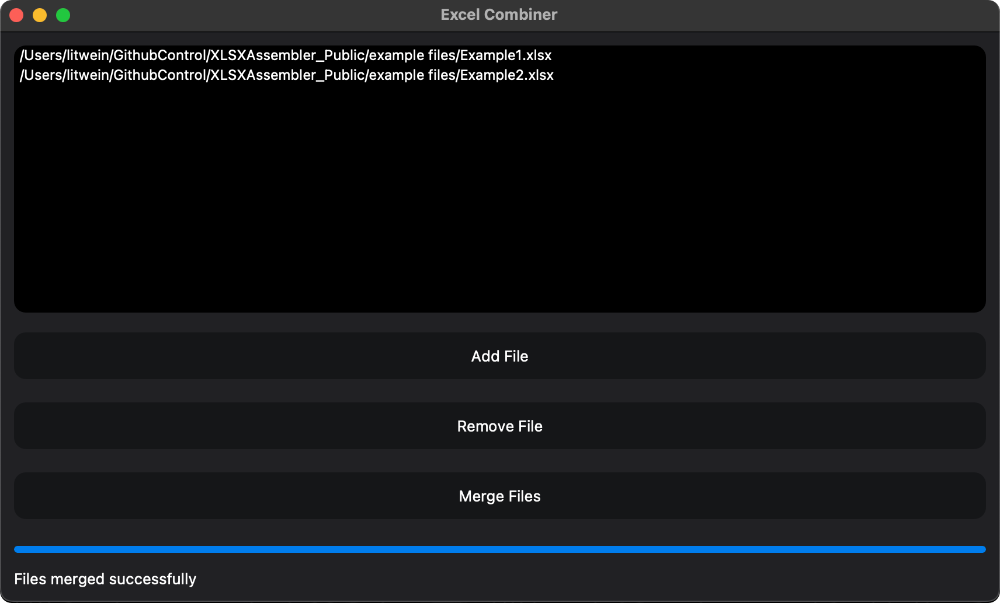

<h2 align="center">
  XLSX Assembler – ETL Tool for Merging Excel Data
</h2>

  

 

 &nbsp;
 &nbsp;
 &nbsp;
 &nbsp;

## Built With

This project was built using these technologies.

- Python
- Pandas
- Openpyxl
- PyQT5
- Excel
- JB PyCharm

## Features

**🚀 Efficient ETL Process**

Automates the extraction, transformation, and loading (ETL) of data from multiple Excel files.\
(Only specific excel structure)

**📊 Advanced Data Processing**

Leverages the power of Pandas and Openpyxl for fast and accurate data reading, processing, and styling.

**💻 Intuitive GUI with PyQt5**

Includes a user-friendly graphical interface for selecting files and tracking real-time progress.

**⚡ Performance Optimization**

Optimized for reduced system load and faster data processing, ensuring efficient handling of large datasets.

## Getting Started

Prerequisites:
- `Python` installed globally on your machine
- `pip` for package installation

## 🛠 Installation and Setup Instructions

1. Clone the repository:
`git clone https://github.com/NickLitwinow/XLSXAssembler_Public.git`

2. Install the necessary dependencies:
`pip install -r requirements.txt`

3. Run the ETL tool:
`python app.py`

The PyQt5 GUI will launch, where you can select multiple Excel files and begin the ETL process.
*Runs the app in the development mode.*

## Usage Instructions

1. Open the project folder and navigate to `/src/`.
2. The supplimental data processing logic can be found in the `excel_operations.py` file.
3. The GUI and core data manipulation logic is housed in `app.py`.
4. To process your Excel files, simply run the application `python app.py`, select your files using the GUI, and click the "Merge Files" button to merge and transform the data.

## Show your support

Give a ⭐ if you like this project!
